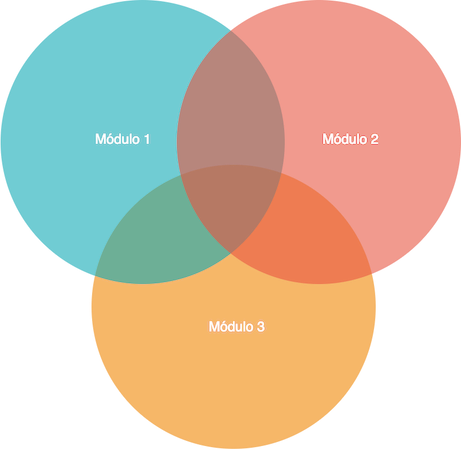

## 👋 Hola

.left-column-66[

#### Lorenzo Peña

-   Oriental de Holguín
-   Djangonauta hace 12 años
-   Fan de la pizza con atún

]
.right-column-33[]

---

name: title
class: middle center


---

class: middle center


---

template: title

--

7️⃣ cosas que el yo del presente quisiera decirle al yo del pasado al empezar un projecto de Django de cero

---

layout: true

## Las apps de Django no son lo que parecen

---

---

.center[]

???

Pensamos que las apps proveen de separación lógica.

---

.center[]

???

Terminamos con apps espaguettis, límites difusos, migraciones enredadas.

---

layout: false
class: middle center

# Una sola app es suficiente para empezar

???

Las aplicaciones son buenas para paquetes instalables, pero no lo son en la mayoría de los casos para separación lógica de módulos dentro de un proyecto.

---

layout: true

## Aléjate de django.contrib.auth.models.User

---

---

<br/>

.center[]

???

Al principio, Django no permitía usar un modelo usuario personalizado.
Había que usar un modelo Profile.
Eso es cosa del pasado (desde Django 1.7)

---

.center[]

???

Siempre necesitamos personalizar el modelo User.
Cambiar de modelo de usuario en la marcha es complicado.

---

layout: false
class: middle center

# Empieza de cero con un User personalizado

---

layout: true

## Model.clean te va a decepcionar

---

---

.center[]

---

<br/>

> Validar un huevo es fácil,
> <br/>un cartón son otros .strike[20 ]300 pesos.
> <br/> .center[---Anónimo]

---

.left-column[

##### .blue[Persistencia]

```python
Model.clean()
```

]

.right-column[

##### .blue[Entrada]

```python
Form.clean()
Serializer.validate()
```

]

--

.right-column-33[☝️ ☝️]

---

layout: false
class: middle center

# Valida en la capa de entrada

???

-   Los model fields son buenos para validar valores aislados
-   Para validar un modelo, Model.clean es una quimera, no es posible validar varios modelos
-   Opinión: La validación de negocio va en la capa de entrada del usuario (serializers, forms)
-   Si hay forms y serializers en tandem, extrae lógica a funciones utilitarias

---

layout: true

## Las Queries son tus amigas

---

---

background-image: url(images/invoice.png)

---

.left-column[]

--

.right-column[
.strike[`Model.objects.all()`]

```
Model.objects
    .select_related(🚂)
    .prefetch_related(🏠)
    .annotate(🐘)
```

]

---

layout: false
class: middle center

# Usa managers y queries personalizadas

---

layout: false
class: middle center

# Piensa más en queries que en models

???

-   En la respuesta al usuario muchas veces se necesitan datos de varios modelos, o agregaciones
-   Es fácil caer en N+1 cuando nos dejamos llevar por las bondades del ORM
-   Pronto la noción de responder con un modelo es remplazada por la noción de responder con una consulta
-   Django tiene Managers y Queries para encapsular lógica de consulta

---

layout: true

## Rompe la base de datos

---

---

.center[]

---

##### .blue[Tres fuentes de decepción]

--

-   `unique=True` y `unique_together` me dan protección

--

-   si pongo `null=True blank=True` se rompe

--

-   la 🌈 felicidad es una base de datos normalizada

---

layout: false
class: middle center

# No resuelvas en la base de datos lo que puedes resolver en código

---

layout: false
class: middle center

# Optimización >> Normalización

???

-   Nos enseñaron a poner constraints, null=False, y a normalizar la BD
-   A veces se necesita tener datos "inconsistentes" y reaccionar a ellos
-   Es mejor resolver un problema de código que un problema de datos

---

layout: true

## Otras pequeñas cosas

---

---

-   Escribe tests, optimízalos

--

-   No uses signals, a menos que sea necesario

---

layout: true

## No todo lo que brilla es oro

---

---

.center[]

???

-   No todo lo que se presenta como buena práctica es realmente una buena práctica
-   Escoge tus fuentes de respeto
-   Si necesitas hacerlo, olvida todo lo que te he dicho aquí (yo mismo lo haré si lo necesito)

---

layout: true

## Y se acabó el tiempo

---

##### Puedes encontrarme aquí:

|         |                                                    |
| ------- | -------------------------------------------------- |
| Twitter | [@lorinkoz](https://twitter.com/lorinkoz)          |
| GitHub  | [github.com/lorinkoz](https://github.com/lorinkoz) |
| Correo  | [lorinkoz@gmail.com](mailto:lorinkoz@gmail.com)    |

---

template: title
