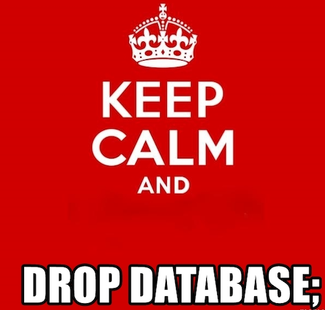

## 👋 Hola

.left-column-66[

#### Lorenzo Peña

-   Oriental de Holguín
-   Djangonauta hace 12 años
-   Fan de la pizza con atún

]
.right-column-33[]

---

name: title
class: middle center

---

class: middle center

---

template: title

--

7+ cosas que el yo del presente quisiera decirle al yo del pasado al empezar un projecto de Django de cero

---

layout: true

## Las apps de Django no son lo que parecen

---

--

???

-   Pensamos que las apps proveen de separación lógica
-   Terminamos con apps espaguettis, límites difusos, migraciones enredadas
-   Moraleja: Una sola app es suficiente para empezar

---

layout: true

## django.contrib.auth.models.User

---

--

???

-   Siempre necesitamos personalizar el modelo User
-   La idea de usar un Profile es un workaround para una limitación del pasado cuando no se podían usar custom models
-   Cambiar de modelo de usuario en la marcha es complicado
-   Moraleja: Empieza de cero con un User model personalizado

---

layout: true

## Fat models?

---

--

???

-   MVC, MVT, y pareciera que el modelo es el HQ de TODA la lógica del negocio
-   Cuando la lógica necesita varios modelos, la idea empieza a quebrarse, problemas de optimización, etc.
-   Pueden usarse funciones utilitarias (servicios) para lógica de negocio con varios modelos
-   Moraleja: ver más el modelo como capa de acceso a datos que como capa de negocio

---

layout: true

## El dilema de la validación

---

--

???

-   Los model fields son buenos para validar valores aislados
-   Para validar un modelo, Model.clean es una quimera, no es posible validar varios modelos
-   Opinión: La validación de negocio va en la capa de entrada del usuario (serializers, forms)
-   Si hay forms y serializers en tandem, extrae lógica a funciones utilitarias
-   Moraleja: Mueve toda la validación posible a la capa de entrada

---

layout: true

## Donde dije Models, digo Queries

---

--

???

-   En la respuesta al usuario muchas veces se necesitan datos de varios modelos, o agregaciones
-   Es fácil caer en N+1 cuando nos dejamos llevar por las bondades del ORM
-   Pronto la noción de responder con un modelo es remplazada por la noción de responder con una consulta
-   Django tiene Managers y Queries para encapsular lógica de consulta
-   Moraleja: piensa en queries, no en models

---

layout: true

## Rompe la base de datos

---

--

???

-   Nos enseñaron a poner constraints, null=False, y a normalizar la BD
-   A veces se necesita tener datos "inconsistentes" y reaccionar a ellos
-   Es mejor resolver un problema de código que un problema de datos
-   Moraleja: evita las restricciones, denormaliza sin miedo, abraza los valores nulos

---

layout: true

## Otras pequeñas cosas

---

--

-   Escribe tests, optimiza los tests
-   Evita usar las signals, pero si tienes que hacerlo, hazlo

---

layout: true

---

## No todo lo que brilla es oro

--

???

-   No todo lo que se presenta como buena práctica es realmente una buena práctica
-   Escoge tus fuentes de respeto
-   Si necesitas hacerlo, olvida todo lo que te he dicho aquí (yo mismo lo haré si lo necesito)

---

layout: true

## Y se acabó el tiempo

---

##### Puedes encontrarme aquí:

|         |                                                    |
| ------- | -------------------------------------------------- |
| Twitter | [@lorinkoz](https://twitter.com/lorinkoz)          |
| GitHub  | [github.com/lorinkoz](https://github.com/lorinkoz) |
| Correo  | [lorinkoz@gmail.com](mailto:lorinkoz@gmail.com)    |

---

template: title
